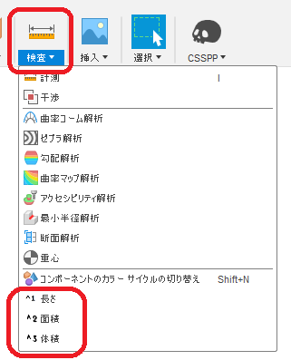

# **MENSEKI**

Autodesk社 ソフト <b>"Fusion360" </b> のアドインです。

## 特徴
選択された複数面の合計面積、複数ボディの合計体積、複数エッジの合計長さを表示します。

(ゴリゴリの某3DCAD試験対策用）

## 設置
こちらの手順に従い、アドインとして「MENSEKI_Addin」フォルダを追加してください。

[Fusion 360にアドインまたはスクリプトをインストールする方法](
https://knowledge.autodesk.com/ja/support/fusion-360/troubleshooting/caas/sfdcarticles/sfdcarticles/JPN/How-to-install-an-ADD-IN-and-Script-in-Fusion-360.html)

## 使用
アドイン実行すると、「基本フューチャー ソリッド」「基本フューチャー サーフェス」
「シートメタル」タブ時の「検査」パネル内に以下のコマンドが追加され、通常のコマンド同様に使用頂けます。

## 動作
以下の環境にて確認。
+ Fusion360 Ver2.0.9305
+ Windows10 64bit Pro

## 例
+ ダイアログ

+ ツールチップ

